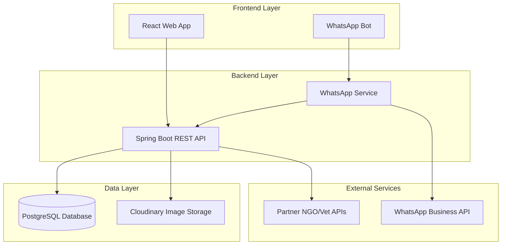

# Design Document

## Overview

Paww MVP is a full-stack application consisting of a Spring Boot backend, React frontend, and WhatsApp bot integration. The system enables stray dog registration and adoption through multiple channels while maintaining simplicity and direct connections between users.

## Architecture

### High-Level Architecture



### Technology Stack

**Backend:**
- Spring Boot 3.x with Java 17
- Spring Data JPA for database operations
- Spring Web for REST APIs
- PostgreSQL with PostGIS extension for geographic queries
- Cloudinary Java SDK for image management
- WhatsApp Business API integration

**Frontend:**
- React 18 with TypeScript
- Vite for build tooling
- Tailwind CSS for styling
- React Router for navigation
- Axios for API communication
- React Query for state management

**Infrastructure:**
- PostgreSQL database with PostGIS extension
- Cloudinary for image storage and optimization
- WhatsApp Business API for bot functionality

## Components and Interfaces

### Backend Components

#### 1. Dog Service
**Responsibilities:**
- Dog profile CRUD operations
- Geographic search functionality
- Image URL management
- Validation and business logic

**Key Methods:**
```java
@Service
public class DogService {
    Dog registerDog(DogRegistrationRequest request);
    List<Dog> searchDogs(DogSearchCriteria criteria);
    Dog getDogById(Long id);
    List<Dog> findNearbyDogs(Location location, double radiusKm);
}
```

#### 2. User Service
**Responsibilities:**
- User profile management
- Role-based access control
- Contact information management

**Key Methods:**
```java
@Service
public class UserService {
    User createUser(UserRegistrationRequest request);
    User getUserById(Long id);
    User getUserByPhone(String phone);
    void updateUserProfile(Long userId, UserUpdateRequest request);
}
```

#### 3. Adoption Service
**Responsibilities:**
- Adoption interest tracking
- Contact information retrieval
- NGO/Vet referral management

**Key Methods:**
```java
@Service
public class AdoptionService {
    ContactInfo getRegistrantContact(Long dogId);
    void logAdoptionInterest(Long dogId, Long adopterId);
    void sendVaccinationReferral(Long dogId, Long adopterId);
}
```

#### 4. WhatsApp Bot Service
**Responsibilities:**
- WhatsApp message processing
- Conversation flow management
- Integration with core services

**Key Methods:**
```java
@Service
public class WhatsAppBotService {
    void processIncomingMessage(WhatsAppMessage message);
    void sendMessage(String phoneNumber, String message);
    void sendImageMessage(String phoneNumber, String imageUrl, String caption);
}
```

#### 5. Image Service
**Responsibilities:**
- Cloudinary integration
- Image upload and optimization
- URL generation and management

**Key Methods:**
```java
@Service
public class ImageService {
    String uploadImage(MultipartFile file);
    String getOptimizedImageUrl(String publicId, ImageTransformation transformation);
    void deleteImage(String publicId);
}
```

### Frontend Components

#### 1. Dog Registration Component
**Responsibilities:**
- Registration form UI
- Image upload handling
- Form validation
- API integration

#### 2. Dog Search Component
**Responsibilities:**
- Search filters UI
- Results display
- Pagination
- Geographic search integration

#### 3. Dog Profile Component
**Responsibilities:**
- Detailed dog information display
- Adoption button functionality
- Image gallery
- Contact initiation

#### 4. User Dashboard Component
**Responsibilities:**
- User profile management
- Registered dogs overview
- Adoption activity tracking

### API Endpoints

#### Dog Management
```
POST /api/dogs
GET /api/dogs?location={lat,lng}&radius={km}&age={age}&gender={gender}&vaccinated={boolean}
GET /api/dogs/{id}
PUT /api/dogs/{id}
DELETE /api/dogs/{id}
```

#### User Management
```
POST /api/users
GET /api/users/{id}
PUT /api/users/{id}
GET /api/users/profile
```

#### Adoption
```
POST /api/adoptions/{dogId}/contact
POST /api/adoptions/{dogId}/referral
GET /api/adoptions/interests/{userId}
```

#### WhatsApp Integration
```
POST /api/whatsapp/webhook
POST /api/whatsapp/send-message
```

## Data Models

### Core Entities

#### Dog Entity
```java
@Entity
@Table(name = "dogs")
public class Dog {
    @Id
    @GeneratedValue(strategy = GenerationType.IDENTITY)
    private Long id;
    
    @Column(nullable = false)
    private String name;
    
    @Column(length = 1000)
    private String description;
    
    private Integer age;
    
    @Enumerated(EnumType.STRING)
    private Gender gender;
    
    @Column(name = "image_url")
    private String imageUrl;
    
    @Column(name = "additional_images")
    @ElementCollection
    private List<String> additionalImages;
    
    @Embedded
    private Location location;
    
    @Column(name = "registered_by_user_id")
    private Long registeredByUserId;
    
    @Enumerated(EnumType.STRING)
    private VaccinationStatus vaccinationStatus;
    
    @Column(name = "unique_dog_id")
    private String uniqueDogId;
    
    @CreationTimestamp
    private LocalDateTime createdAt;
    
    @UpdateTimestamp
    private LocalDateTime updatedAt;
    
    @Enumerated(EnumType.STRING)
    private DogStatus status; // AVAILABLE, ADOPTED, REMOVED
}
```

#### User Entity
```java
@Entity
@Table(name = "users")
public class User {
    @Id
    @GeneratedValue(strategy = GenerationType.IDENTITY)
    private Long id;
    
    @Column(nullable = false)
    private String name;
    
    @Column(nullable = false, unique = true)
    private String phone;
    
    private String email;
    
    @Enumerated(EnumType.STRING)
    private UserRole role; // REGISTRANT, ADOPTER, BOTH
    
    private String city;
    
    @Embedded
    private ContactPreferences contactPreferences;
    
    @CreationTimestamp
    private LocalDateTime createdAt;
}
```

#### Location Embedded Object
```java
@Embeddable
public class Location {
    @Column(name = "latitude")
    private Double latitude;
    
    @Column(name = "longitude")
    private Double longitude;
    
    @Column(name = "address")
    private String address;
    
    @Column(name = "city")
    private String city;
    
    @Column(name = "state")
    private String state;
}
```

#### Adoption Interest Entity
```java
@Entity
@Table(name = "adoption_interests")
public class AdoptionInterest {
    @Id
    @GeneratedValue(strategy = GenerationType.IDENTITY)
    private Long id;
    
    @Column(name = "dog_id")
    private Long dogId;
    
    @Column(name = "adopter_id")
    private Long adopterId;
    
    @CreationTimestamp
    private LocalDateTime interestedAt;
    
    @Enumerated(EnumType.STRING)
    private InterestStatus status; // INTERESTED, CONTACTED, ADOPTED, WITHDRAWN
}
```

### Database Schema Considerations

**Geographic Indexing:**
- Use PostGIS extension for efficient geographic queries
- Create spatial index on location coordinates
- Support radius-based searches with proper performance

**Performance Optimization:**
- Index on frequently queried fields (location, status, created_at)
- Implement database connection pooling
- Use pagination for large result sets

## Error Handling

### API Error Response Format
```json
{
  "error": {
    "code": "DOG_NOT_FOUND",
    "message": "Dog with ID 123 not found",
    "timestamp": "2025-01-17T10:30:00Z",
    "path": "/api/dogs/123"
  }
}
```

### Error Categories

**Validation Errors (400):**
- Missing required fields
- Invalid data formats
- Business rule violations

**Authentication Errors (401):**
- Invalid or missing authentication tokens
- Expired sessions

**Authorization Errors (403):**
- Insufficient permissions for requested operation

**Not Found Errors (404):**
- Requested resource does not exist

**Server Errors (500):**
- Database connection failures
- External service unavailability
- Unexpected system errors

### WhatsApp Bot Error Handling
- Graceful fallback messages for system errors
- User-friendly error explanations
- Retry mechanisms for transient failures
- Escalation to human support when needed

## Testing Strategy

### Backend Testing

**Unit Tests:**
- Service layer business logic
- Repository layer data access
- Utility functions and validators
- Target: 80%+ code coverage

**Integration Tests:**
- API endpoint functionality
- Database operations
- External service integrations
- WhatsApp webhook processing

**Performance Tests:**
- Geographic search query performance
- Image upload and processing
- Concurrent user scenarios
- Database query optimization

### Frontend Testing

**Component Tests:**
- Individual React component functionality
- User interaction scenarios
- Form validation logic
- API integration points

**End-to-End Tests:**
- Complete user workflows
- Cross-browser compatibility
- Mobile responsiveness
- Accessibility compliance

### WhatsApp Bot Testing

**Conversation Flow Tests:**
- Registration flow completion
- Search functionality
- Error handling scenarios
- Multi-step conversation management

**Integration Tests:**
- WhatsApp API connectivity
- Message processing accuracy
- Image handling capabilities
- Fallback mechanisms

### Test Data Management
- Automated test data setup and cleanup
- Mock external services for isolated testing
- Geographic test data for location-based features
- Image upload testing with sample files

## Security Considerations

### Data Protection
- Input validation and sanitization
- SQL injection prevention
- XSS protection in frontend
- Secure image upload validation

### API Security
- Rate limiting on public endpoints
- Request size limitations
- CORS configuration
- Input validation middleware

### WhatsApp Integration Security
- Webhook signature verification
- Message content validation
- Rate limiting on bot interactions
- Secure credential management

### Privacy Protection
- Contact information access controls
- User consent for data sharing
- Data retention policies
- GDPR compliance considerations